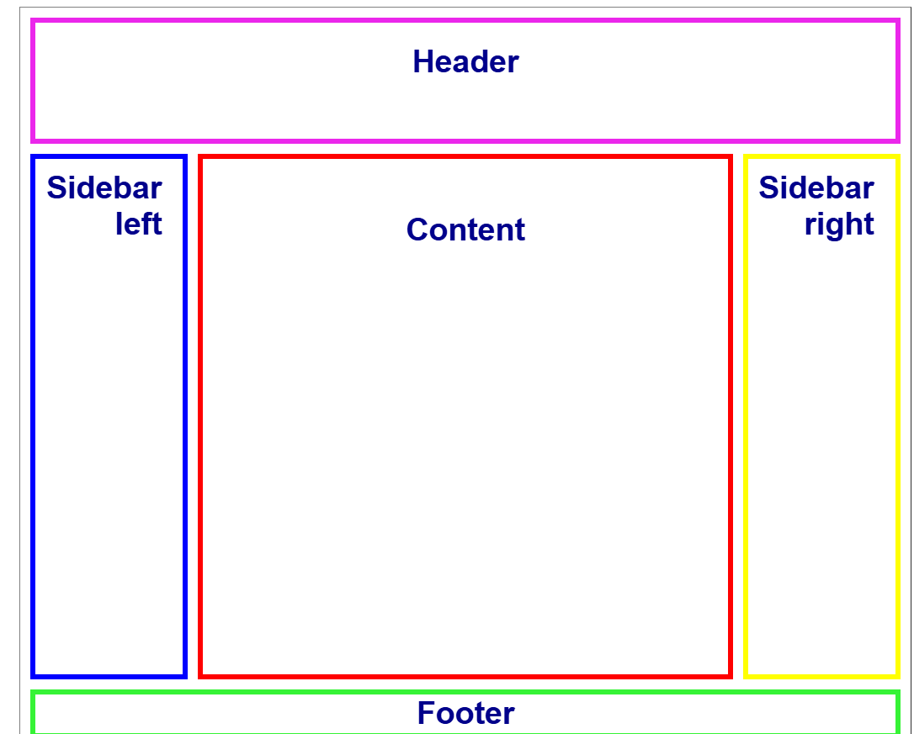

  

$\color{#2F6364}\text{\LARGE Sinh viên: Trần Văn Việt Anh}$

$\color{#2F6364}\text{\Large MSSV: 63131839}$  |  $\color{#2F6364}\text{\Large Môn: Thiết Kế Web}$

   
  
  
  
    

---
## 📂 PROJECTS

| PREVIEW | INFORMATION |
| :--- | :--- |
|  |  **Bài 1. Sử dụng thẻ Table dể tạo Layout**  Bài 1. Sử dụng thẻ table dể tạo layout.  🔗 [**Xem Source Code**](./Lab1_Bai1_TranVanVietAnh_63131839.html) |
|  |  **02. GLASSMORPHISM LOGIN**  Giao diện đăng nhập phong cách kính mờ (Glassmorphism).  🔗 [**Xem Source Code**](./Bai2_Login) |
|  |  **03. COMING SOON...**  Đang cập nhật bài tập mới.  🚧 *Đang thi công* |

---

  <i>Have a nice day! 🔥🔥🔥</i>

